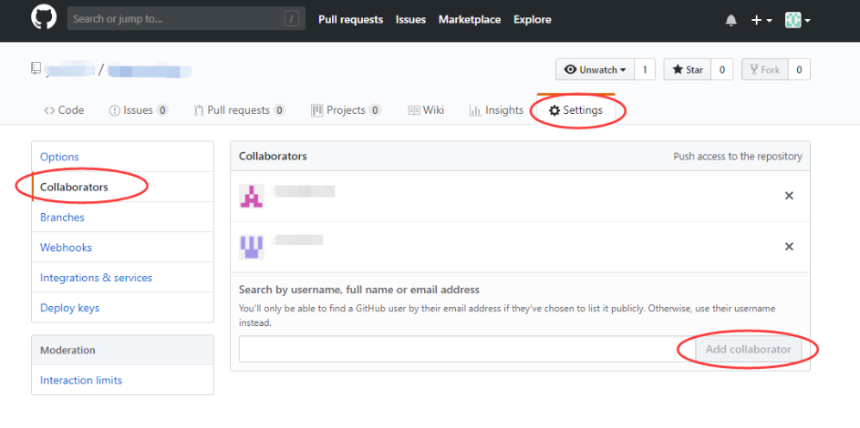

组长负责建立`github`仓库( 或者使用已有的仓库 )统一管理代码，并按照下面教程添加组员


# 添加合作者



在仓库Settings页面的Collaborators处，可以根据用户名搜索，添加合作者。

在自己这边点击了Add collaborator以后，Github会给对方发一份邮件到注册的那个邮箱，`对方要在邮件中确认以后才算是添加成功。`


****


# 克隆代码

每位组员都使用`git clone`此仓库的代码，在这个仓库里进行开发。


# 合并冲突

## **冲突怎么产生的？**

比如`A`同学删除了项目中线上的`a.vue`文件，但是`B`同学本地还有`a.vue`文件，此时`B`同学如果提交了他本地的`a.vue`文件，就会发生冲突了。


## **怎么解决冲突？** 

必须保证每次修改代码前要`合并代码`

```
git pull
```

然后再修改代码可避免错误


### `!`终极方案

如果冲突的内容很多，或者修改麻烦，可以重新克隆一份新的仓库代码，然后再修改。

